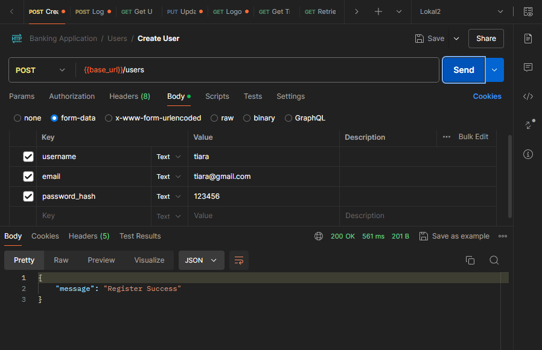
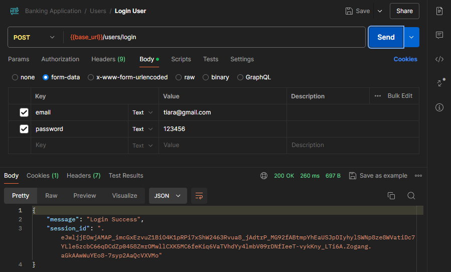
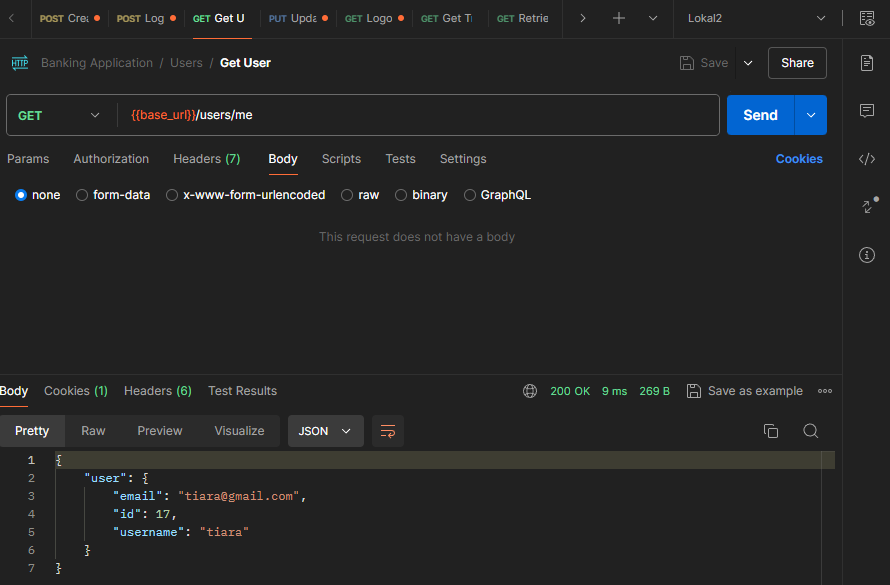
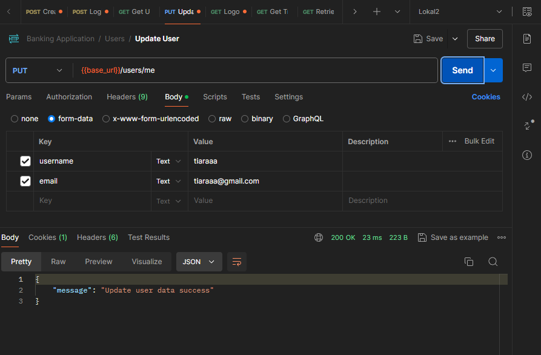
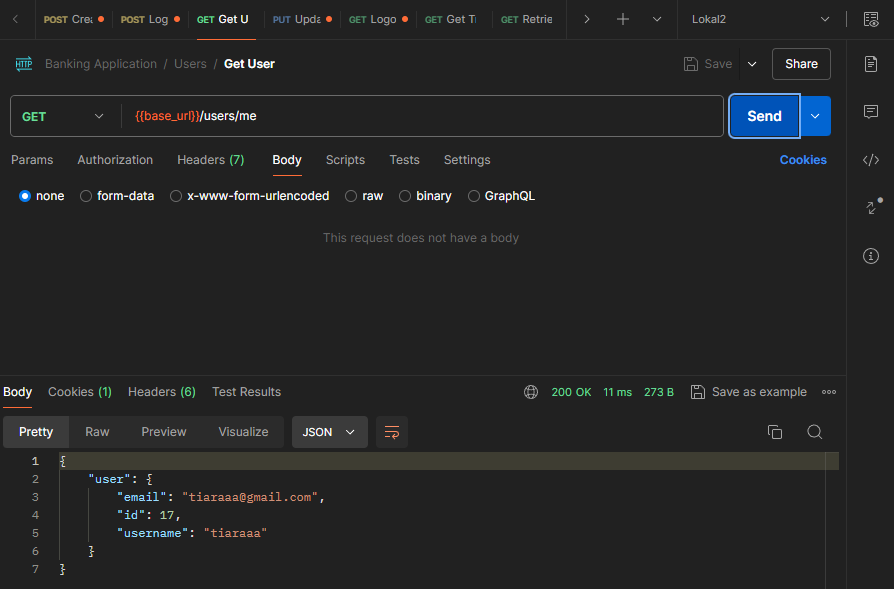
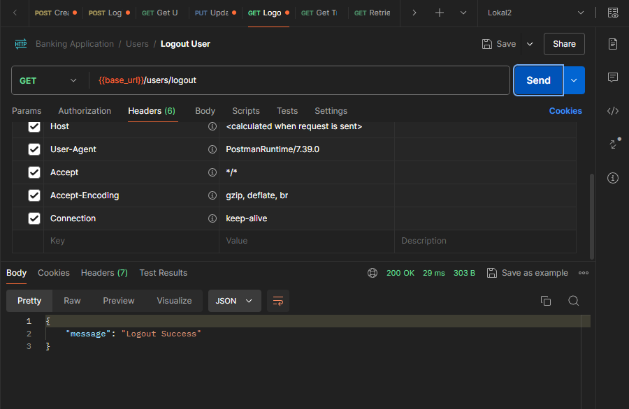

# Flask API Banking Application Project

## Overview
This project is a banking application API built using Flask, a micro web framework for Python. The API provides endpoints for managing users, accounts, and transactions. The endpoints are tested using Postman, and the API documentation is available via Postman.

## Endpoints

1. User Management: 
- POST /users: Create a new user account 
- GET /users/me: Retrieve the profile of the currently authenticated user. 
- PUT /users/me: Update the profile information of the currently authenticated user. 

2. Account Management: 
- GET /accounts: Retrieve a list of all accounts belonging to the currently authenticated user.
- GET /accounts/:id: Retrieve details of a specific account by its ID. (Authorization required for account owner)
- POST /accounts: Create a new account for the currently authenticated user.
- PUT /accounts/:id: Update details of an existing account. (Authorization required for account owner)
- DELETE /accounts/:id: Delete an account. (Authorization required for account owner) 

3. Transaction Management: 
- GET /transactions: Retrieve a list of all transactions for the currently authenticated user's accounts. (Optional: filter by account ID, date range)
- GET /transactions/:id: Retrieve details of a specific transaction by its ID. (Authorization required for related account owner)
- POST /transactions: Initiate a new transaction (deposit, withdrawal, or transfer). (Authorization required for related account owner)

## Dependencies
- Flask
- Flask-Login
- bcrypt
- mysql-connector-python
- SQLAlchemy

## Authentication
The project uses Flask-Login for authentication and bcrypt for password hashing. Ensure that user registration and login endpoints are implemented to handle authentication.

## Postman API Documentation
### Documentation
API Documentation Link: https://documenter.getpostman.com/view/34517544/2sA3dyjC1N

### Screenshots
1. User Management
- POST /users

- POST /users/login

- GET /users/me

- PUT /users/me

- GET /users/logout

.png) 
.png)

